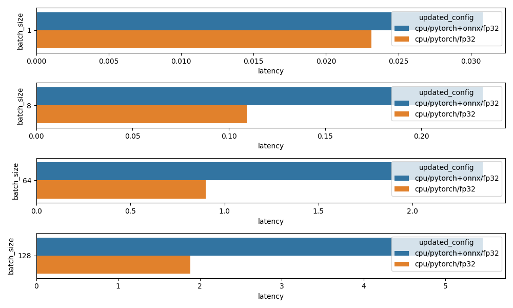

# HuggingFace + ONNX + FastAPI benchmarks
Goal here is to get lantecy stats when serving sentence transfomers over an API with different runtime setups.
- cpu (pytorch)
- cpu (pytorch + onnx/fp32)
- gpu (pytorch)
- gpu (pytorch + onnx/fp32)
- gpu (pytorch + onnx/fp16)

## Setup
---
Modify `MODEL` to the appropriate huggingface model and run setup.py
```
MODEL = "sentence-transformers/LaBSE"
ONNX_MODEL = "labse"

>> python utils/setup.py
```
This will create the onnx optimized as well as fp16 quantized models.

Generate prediction timings for different configurations
```
>> python generate_report.py --is_cpu t --is_onnx f --is_fp16 f
>> python generate_report.py --is_cpu t --is_onnx t --is_fp16 f
>> python generate_report.py --is_cpu f --is_onnx f --is_fp16 f
>> python generate_report.py --is_cpu f --is_onnx t --is_fp16 f
>> python generate_report.py --is_cpu f --is_onnx t --is_fp16 t
```

Generate the plots
```
>> python generate_plot.py
```

### CPU

### GPU (RTX 3080)


## Classifier training and validation report
---
data/atis.csv
---
`GPU + pytorch fp32`
```
>> data/atis.csv
config: _is_cpu_: False | _is_onnx_: False | _is_fp16_: False
encoding data ... done!
train_X: 4688, train_y: 4688
val_X  : 1172,   val_y: 1172
scaling features ... done!
training model ... done!
                    precision    recall  f1-score   support

      abbreviation       0.95      0.97      0.96        36
          aircraft       0.71      0.94      0.81        18
           airfare       0.93      0.93      0.93        94
           airline       0.95      0.90      0.92        39
           airport       0.89      1.00      0.94         8
          capacity       1.00      0.86      0.92         7
              city       1.00      0.60      0.75         5
          distance       0.86      1.00      0.92         6
            flight       0.99      0.98      0.98       859
flight and airfare       0.55      0.86      0.67         7
         flight_no       0.80      1.00      0.89         4
       flight_time       0.71      0.91      0.80        11
       ground_fare       0.83      1.00      0.91         5
    ground_service       0.96      0.95      0.96        58
              meal       1.00      0.33      0.50         3
          quantity       0.75      0.90      0.82        10
       restriction       1.00      0.50      0.67         2

          accuracy                           0.96      1172
         macro avg       0.87      0.86      0.84      1172
      weighted avg       0.97      0.96      0.96      1172

total time:  2.72s # only the time to encode using LaBSE
```

`GPU + pytorch + onxx fp16`
```
>> data/atis.csv
config: _is_cpu_: False | _is_onnx_: True | _is_fp16_: True
encoding data ... done!
train_X: 4688, train_y: 4688
val_X  : 1172,   val_y: 1172
scaling features ... done!
training model ... done!
                    precision    recall  f1-score   support

      abbreviation       0.97      0.97      0.97        36
          aircraft       0.77      0.94      0.85        18
           airfare       0.92      0.93      0.92        94
           airline       0.94      0.87      0.91        39
           airport       0.88      0.88      0.88         8
          capacity       1.00      0.86      0.92         7
              city       1.00      0.60      0.75         5
          distance       0.86      1.00      0.92         6
            flight       0.99      0.98      0.98       859
flight and airfare       0.50      0.86      0.63         7
         flight_no       0.67      1.00      0.80         4
       flight_time       0.77      0.91      0.83        11
       ground_fare       0.83      1.00      0.91         5
    ground_service       0.95      0.95      0.95        58
              meal       1.00      0.33      0.50         3
          quantity       0.69      0.90      0.78        10
       restriction       1.00      0.50      0.67         2

          accuracy                           0.96      1172
         macro avg       0.87      0.85      0.83      1172
      weighted avg       0.96      0.96      0.96      1172

total time:  1.15s # only the time to encode using LaBSE
```

data/snips.csv
---
`GPU + pytorch fp32`
```
>> data/snips.csv
config: _is_cpu_: False | _is_onnx_: False | _is_fp16_: False
encoding data ... done!
train_X: 11602, train_y: 11602
val_X  : 2901,   val_y: 2901
scaling features ... done!
training model ... done!
                      precision    recall  f1-score   support

       AddToPlaylist       0.99      1.00      0.99       409
      BookRestaurant       0.99      1.00      1.00       415
          GetWeather       1.00      1.00      1.00       420
           PlayMusic       0.97      0.95      0.96       420
            RateBook       1.00      1.00      1.00       414
  SearchCreativeWork       0.90      0.94      0.92       411
SearchScreeningEvent       0.96      0.92      0.94       412

            accuracy                           0.97      2901
           macro avg       0.97      0.97      0.97      2901
        weighted avg       0.97      0.97      0.97      2901

total time:  5.21s
```

`GPU + pytorch + onxx fp16`
```
>> data/snips.csv
config: _is_cpu_: False | _is_onnx_: True | _is_fp16_: True
encoding data ... done!
train_X: 11602, train_y: 11602
val_X  : 2901,   val_y: 2901
scaling features ... done!
training model ... done!
                      precision    recall  f1-score   support

       AddToPlaylist       0.99      1.00      0.99       409
      BookRestaurant       1.00      1.00      1.00       415
          GetWeather       1.00      1.00      1.00       420
           PlayMusic       0.97      0.96      0.96       420
            RateBook       1.00      0.99      1.00       414
  SearchCreativeWork       0.93      0.97      0.95       411
SearchScreeningEvent       0.99      0.96      0.97       412

            accuracy                           0.98      2901
           macro avg       0.98      0.98      0.98      2901
        weighted avg       0.98      0.98      0.98      2901

total time:  2.22s # only the time to encode using LaBSE
```